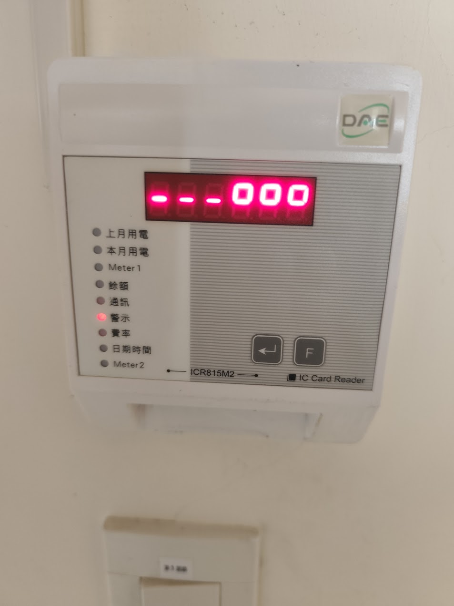
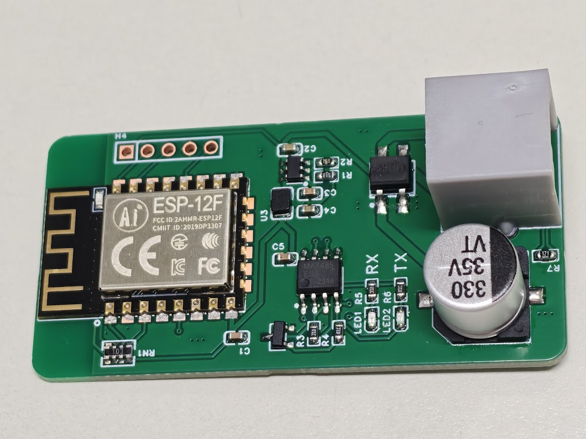

# DEM510C

本專案設計可直接替換用戶房間 **ICR815M2 讀卡機**的硬體裝置，安裝於原卡機位置，沿用既有 **6P4C 電話線**連接台科電 DEM510C 數位電表，模擬原有卡機的通訊行為。透過 RS485 通訊命令，可直接控制電表內**保持繼電器（Latch Relay）的通斷**，切換負載供電，**無須插卡**。

## 通訊架構

房間內的讀卡機是 **Master（主站）**，負責主動發送通訊命令；DEM510C 電表是 **Slave（從站）**，接收命令並回覆。兩者使用 **RS485 通訊，透過 6P4C 電話線連接**，通訊封包採用 **Modbus RTU 格式**。

替換後，本專案裝置接替原讀卡機的 Master 角色，與既有 DEM510C 電表通訊。6P4C 的腳位、線色及功能對照請參閱[硬體架構與配線說明](docs/hardware-architecture.md#6p4c-腳位表)；接線以腳位編號與功能為主，線色僅供參考。

## 原有讀卡機與本專案替換裝置

| 原有讀卡機 ICR815M2 | 本專案 V3.0 替換裝置 |
| :---: | :---: |
|  |  |
| 原有房間讀卡機，型號為 **ICR815M2**，作為 Master 與 DEM510C 電表通訊。 | 本專案設計的替換硬體，接替 ICR815M2 的 Master 角色，模擬原卡機與電表的通訊行為。 |

## 測試範例 DEM510C_Test

[DEM510C_Test](Software/DEM510C_Test/DEM510C_Test.ino) **僅供測試使用**，用來模擬讀卡機發送的輪詢訊號，以及讓電表內保持繼電器導通的訊號。範例會依序傳送讀取與繼電器導通命令，便於觀察電表回覆。

實際上，若只需要讓站號 `0x01` 電表的保持繼電器導通，**僅需傳送以下導通命令，無須重現範例中的整套讀取輪詢訊號**：

```cpp
0x01, 0x05, 0x00, 0x00, 0xFF, 0x00, 0x8C, 0x3A
```

這是一個完整的 Modbus RTU 封包，共 8 個位元組，格式為「站號 → 功能碼 → 資料 → CRC」。各位元組的意義如下：

| 位元組位置 | 數值 | 欄位 | 意義 |
| --- | --- | --- | --- |
| 1 | `0x01` | 從站位址 | 指定站號為 1 的電表 |
| 2 | `0x05` | 功能碼 | 寫入單一線圈（Write Single Coil），用於控制保持繼電器 |
| 3 | `0x00` | 控制位址高位元組 | 與第 4 個位元組組成 `0x0000`，指定保持繼電器 |
| 4 | `0x00` | 控制位址低位元組 | 與第 3 個位元組共同表示控制位址 |
| 5 | `0xFF` | 寫入值高位元組 | 與第 6 個位元組組成 `0xFF00`，表示導通（ON） |
| 6 | `0x00` | 寫入值低位元組 | 與第 5 個位元組共同表示導通命令 |
| 7 | `0x8C` | CRC 低位元組 | CRC-16/MODBUS 校驗值的低位元組，先傳送 |
| 8 | `0x3A` | CRC 高位元組 | CRC 校驗值的高位元組，後傳送；完整校驗值為 `0x3A8C` |

實際傳送的是上述 8 個二進位位元組，不是十六進位文字字串。CRC 依前 6 個位元組計算；若更改站號或命令內容，需重新計算 CRC。

**電表若連續 30 秒未收到保持繼電器導通命令，就會斷開保持繼電器。** 因此，要持續供電，主站必須以小於 30 秒的間隔週期性傳送導通命令，並預留通訊延遲或重試的時間。此處的「僅需傳送導通命令」是指無須重現其他讀取輪詢訊號，並非只傳送一次就能永久保持導通。

## 文件

- [DEM510C 電表通訊協定（繁體中文）](docs/communication-protocol.md)：以 PC 端為主的通訊參數、暫存器、封包格式、控制指令、CRC 範例及待確認事項。
- [DEM510C 硬體架構與配線說明](docs/hardware-architecture.md)：架構圖、電路板、計量與繼電器配置，以及透過 6P4C 電話接頭連接用戶房間讀卡機的 RS485 通訊介面與腳位表。

卡機端與 PC 端的通訊參數及命令適用範圍需分別確認，請參閱協定文件中的「待確認事項」。文件中的封包範例已核對 CRC，尚未以實體電表驗證。
