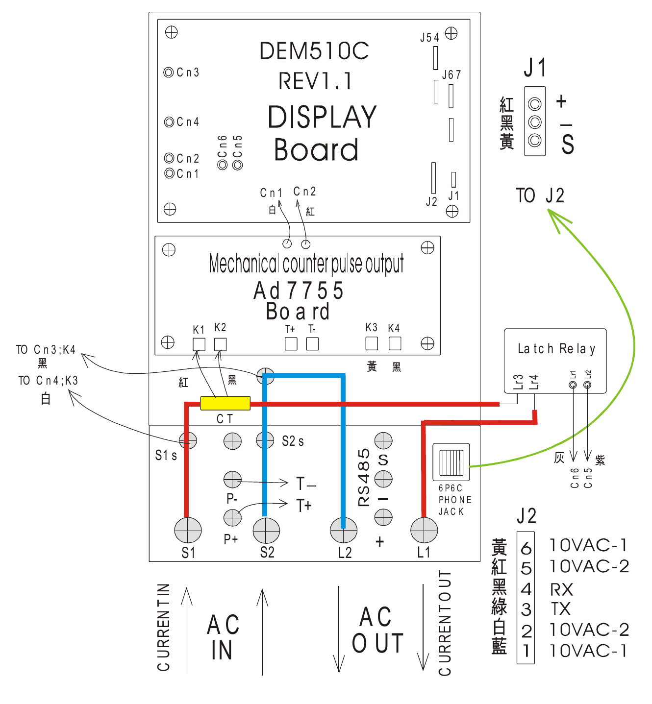

# DEM510C 硬體架構與配線說明



DEM510C 的硬體可分為顯示板、電度計量板、電流感測、負載控制及通訊接頭。**電表與用戶房間讀卡機之間使用 RS485 通訊，透過 6P4C 電話接頭連接。** 本文說明圖中的元件、接頭及連接關係；封包格式與控制命令請參閱[電表通訊協定](communication-protocol.md)。

## 主要硬體區塊

| 圖中位置與標示 | 區塊 | 功能與圖示內容 |
| --- | --- | --- |
| 上方 `DEM510C REV1.1 DISPLAY Board` | 顯示板 | 顯示電表資訊，並設有 `Cn1` 至 `Cn6`、`J1`、`J2`、`J54`、`J67` 等連接或設定位置 |
| 中間 `Ad7755 Board` | 電度計量板 | 電度計量相關電路；圖中標有 `K1` 至 `K4`、`T+`、`T-` 及 `Mechanical counter pulse output`（機械計數器脈衝輸出） |
| 計量板下方 `CT` | 電流互感器 | 感測負載電流，圖中以引線連至計量板附近的 `K1`、`K2` |
| 右側 `Latch Relay` | 保持型繼電器 | 控制負載供電；圖中分別呈現負載接點 `Lr3`、`Lr4` 與控制接線 `Lr1`、`Lr2` |
| 下方 `AC IN`、`AC OUT` | 電源輸入與負載輸出 | `AC IN` 位於 `S1`、`S2` 側，`AC OUT` 位於 `L2`、`L1` 側；依圖中箭頭辨識輸入、輸出方向 |
| 下方 `RS485`、`S`、`-`、`+` | 通訊端子區 | 顯示 RS485 相關端子標示；與轉接器 `A/B/GND` 的對照仍需確認 |
| 右下方 `PHONE JACK` | 6P4C 電話接頭 | 用於電表與用戶房間讀卡機的 RS485 連接，腳位定義見文末「房間讀卡機與 6P4C 接頭」 |

圖中的 `REV1.1` 是顯示板標示，與通訊文件中的 C29 功能版本不是同一種版本編號。`J54`、`J67` 的具體用途及設定方式尚待確認。

## 計量與供電路徑

圖中紅、藍粗線呈現主要供電路徑：紅色路徑由 `S1` 側經過 CT 所在位置，再通過繼電器負載接點連至 `L1` 側；藍色路徑連接 `S2` 與 `L2` 側。繼電器因此可控制輸往負載的供電路徑。

計量板上方的脈衝輸出連至顯示板 `Cn1`、`Cn2`，圖中分別標示白、紅線。繼電器的控制接線則以灰、紫線標示，指向顯示板 `Cn6`、`Cn5`。

`S1s`、`S2s`、`P+`、`P-`、`T+`、`T-` 等標記可用來比對板上位置；其完整電氣定義尚未確認，不僅憑名稱推定電壓、極性或可接設備。

## J1 與 J2 標示

### J1 三線接頭

| 線色 | 圖中標示 |
| --- | --- |
| 紅 | `+` |
| 黑 | `-` |
| 黃 | `S` |

此表僅對應圖中 J1 的標示；`S` 的電氣用途，以及這組接線與外部 RS485 端子的完整關係仍待確認，不直接將 `S` 解讀為接地。

### J2 六線接頭

圖中 `PHONE JACK` 旁以綠色箭頭標示 `TO J2`，表示其與 J2 的連接關係。下表為圖中板端 J2 的線色、編號與訊號標示，並非房間讀卡機的 6P4C 接頭腳位表：

| J2 編號 | 線色 | 圖中訊號標示 |
| --- | --- | --- |
| 6 | 黃 | `10VAC-1` |
| 5 | 紅 | `10VAC-2` |
| 4 | 黑 | `RX` |
| 3 | 綠 | `TX` |
| 2 | 白 | `10VAC-2` |
| 1 | 藍 | `10VAC-1` |

上述編號依圖中 J2 表示，尚未確認其與電話插頭接點觀看方向、線材直通或反接方式的對應。`RX`、`TX` 是圖中訊號名稱，不能據此直接判定為 RS485 的 `A/B`，也不能當作已確認的 TTL 或 RS232 接法。

## 接線前需確認的項目

| 項目 | 待確認內容 |
| --- | --- |
| 端子對照 | RS485 `S`、`-`、`+` 與實際讀卡機、PC 轉接器端子的對應 |
| 6P4C 線序 | 插頭觀看方向、接點編號與 J2 六線的對應，以及連接線是否直通 |
| 電源形式 | 10 Vdc 電源需求與 J2 圖示 `10VAC` 的適用範圍，不能視為可互換 |
| 板本差異 | 實機電路板版本、接頭位置與線色是否和圖中一致 |
| 未定義位置 | `J54`、`J67` 及其他測試或設定位置的用途 |

本圖包含市電負載路徑；實際接線應依設備端子標示及確認過的線序進行。

## 房間讀卡機與 6P4C 接頭

電表的卡機端 RS485 使用 **6P4C 電話接頭**，經由連接線接到**用戶房間的讀卡機**。讀卡機與電表交換計費及供電控制相關資訊；卡機端通訊鮑率為 1200 bps。

6P4C 表示接頭有 6 個位置、4 個接點，使用中間的第 2 至第 5 腳，第 1、6 腳為空。這裡的電話接頭是連接器形式，承載的是電表與讀卡機的連接，不表示可直接接入電話網路。

電表另有 PC 端 RS485，供主機讀取電度或下達控制指令。房間讀卡機的 6P4C 連接與 PC 端通訊應分別辨識，不能直接沿用 PC 端的鮑率或接線定義。

### 6P4C 腳位表

下表線色為**本專案作者這台讀卡機的實際線色**，與上方原廠電表接線圖的線色不同。你的設備也可能因實際施工、配線或使用的線材不同，而有不同的線色。**請以腳位編號及其對應功能為主，線色僅供參考，不要只依顏色接線。**

| 腳位 | 1 | 2 | 3 | 4 | 5 | 6 |
| --- | --- | --- | --- | --- | --- | --- |
| 顏色 | 空 | 黃 | 綠 | 紅 | 黑 | 空 |
| 功能 | 空 | B | AC | A | AC | 空 |

`A`、`B` 為 RS485 通訊訊號，`AC` 為交流供電。架構圖中的電話接頭舊標示與此處不同，房間讀卡機接頭以本節的 **6P4C 腳位表**為準。腳位編號的觀看方向尚待確認，不能僅憑左右位置判定線序；比對腳位前，請先確認插頭的觀看方向與編號。

### 卡機內部供電流程

本專案作者這台讀卡機的交流電由 6P4C 接頭的第 3、5 腳（`AC`）輸入，進入卡機後先經過 **MB6S 橋式整流器**，轉換為脈動直流電。整流輸出端連接 **360 µF／35 V 電容**進行濾波，形成約 **18.5 V 直流電**，再透過 **TLV704** 降壓穩壓至 **5 V**，供卡機內部電路使用。

```text
6P4C 第 3、5 腳：交流電輸入
    → MB6S 橋式整流
    → 360 µF／35 V 電容濾波：約 18.5 V DC
    → TLV704 降壓穩壓：5 V DC
```

上述元件規格與電壓對應這台卡機；約 18.5 V 是整流濾波後的直流電壓，不是 6P4C 接頭的交流輸入電壓。
